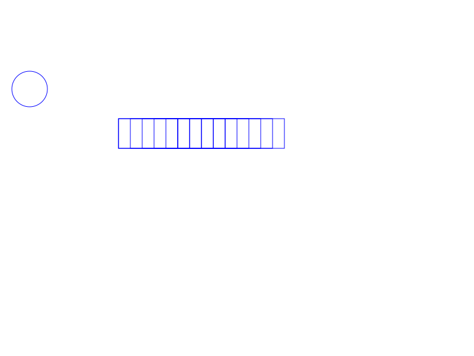

# 🎨 Selber_Sketches

Selber_Sketches é uma linguagem de programação focada na criação de elementos gráficos simples, como círculos, linhas e retângulos, por meio de comandos textuais. A linguagem foi projetada para ser intuitiva, permitindo o uso de variáveis, condições, laços de repetição e agrupamento de formas.

### 📊 Apresentação da Linguagem Selber_Sketches

Você pode acessar a apresentação completa clicando no link abaixo:

[📥 Ver Apresentação (.pdf)](./Selber_Sketches_apresentacao.pdf)


## Sintaxe da Linguagem – EBNF

A linguagem definida abaixo permite a criação de formas geométricas, grupos, estruturas condicionais e repetições, além do uso de variáveis com atribuições e expressões. A gramática está descrita na notação EBNF (Extended Backus-Naur Form), que facilita a visualização da estrutura e regras da linguagem.

```ebnf
program         = { statement } ;

statement       = (shape ";" 
                 | color ";" 
                 | assignment ";" 
                 | conditional 
                 | loop 
                 | group ) ;

shape           = circle | rect | line ;

circle          = "circulo" "x" expr "y" expr "raio" expr ;

rect            = "retangulo" "x" expr "y" expr "largura" expr "altura" expr ;

line            = "linha" "x1" expr "y1" expr "x2" expr "y2" expr ;

color           = "cor" string ;   

group           = "grupo" "{" { statement } "}" [ transform ] ;

transform       = "mover" "x" expr "y" expr ;

conditional     = "se" "(" condition ")" "{" { statement } "}" [ "senao" "{" { statement } "}" ] ;

loop            = "repetir" expr "vezes" "{" { statement } "}" ;

assignment      = identifier assign_op expr ;

assign_op       = "=" | "+=" | "-=" ;

condition       = ( "x" | "y" | "cor_atual" | identifier ) comparator expr ;

comparator      = "==" | ">" | "<" | ">=" | "<=" | "!=" ;

expr            = term { ("+" | "-") term } ;

term            = factor { ("*" | "/") factor } ;

factor          = number | identifier | "(" expr ")" ;

string          = '"' letter { letter | digit | "_" } '"' ;

identifier      = letter { letter | digit | "_" } ;

number          = digit { digit } [ "." digit { digit } ] ;

digit           = "0" | "1" | "2" | "3" | "4" | "5" | "6" | "7" | "8" | "9" ;

letter          = "a" | "b" | "c" | ... | "z" | "A" | "B" | ... | "Z" ;

```
Obs : Funciona para as cores: azul,vermelho, verde, amarelo, preto, branco, roxo, laranja, cinza, caso usado outra string será setado para a cor default preto 
## Como compilar
```
bison -d parser.y
flex lexer.l
gcc parser.tab.c lex.yy.c symbol_table.c -lm -o parser
```
## Entrada:
```
cor "azul";

posicao = 50;

circulo x posicao y 150 raio 30;

posicao +=100;
retangulo x (posicao + 50) y 200 largura 100 altura 50;

repetir 10 vezes {
    retangulo x (posicao + 50) y 200 largura 100 altura 50;
    posicao += 20;
}
```
## Para rodar:
```
./parser exemplo.txt
```

## Output esperado:
### Imagem:


### Código da imagem:
```
<svg xmlns="http://www.w3.org/2000/svg" width="800" height="600" version="1.1">
<circle cx="50" cy="150" r="30" stroke="#0000FF" fill="none"/>
<rect x="200" y="200" width="100" height="50" stroke="#0000FF" fill="none"/>
<rect x="200" y="200" width="100" height="50" stroke="#0000FF" fill="none"/>
<rect x="220" y="200" width="100" height="50" stroke="#0000FF" fill="none"/>
<rect x="240" y="200" width="100" height="50" stroke="#0000FF" fill="none"/>
<rect x="260" y="200" width="100" height="50" stroke="#0000FF" fill="none"/>
<rect x="280" y="200" width="100" height="50" stroke="#0000FF" fill="none"/>
<rect x="300" y="200" width="100" height="50" stroke="#0000FF" fill="none"/>
<rect x="320" y="200" width="100" height="50" stroke="#0000FF" fill="none"/>
<rect x="340" y="200" width="100" height="50" stroke="#0000FF" fill="none"/>
<rect x="360" y="200" width="100" height="50" stroke="#0000FF" fill="none"/>
<rect x="380" y="200" width="100" height="50" stroke="#0000FF" fill="none"/>
</svg>
```
## Características

- **Formas básicas**: `circulo`, `retangulo`, `linha`
- **Manipulação de cores**: comando `cor`
- **Grupos**: agrupar múltiplas formas com `grupo { ... }`
- **Movimentação**: aplicar transformações de movimento com `mover`
- **Variáveis**: atribuição e operações como `=`, `+=`, `-=`
- **Condicionais**: blocos `se { ... }` baseados em comparações
- **Laços de repetição**: `repetir { ... }` com controle baseado em variáveis ou números
- **Expressões aritméticas**: uso de `+`, `-`, `*`, `/` em valores

## Exemplo de código

```plaintext
cor "azul";

posicao = 50;

circulo x posicao y 150 raio 30;

se (posicao == 40){
    posicao +=100;
    circulo x posicao y 150 raio 30;   
} senao{
    posicao +=10;
}
linha x 10 y 20 x 30 y 40;
se (posicao > 10){
    posicao +=10;
}

retangulo x (posicao + 50) y 200 largura 100 altura 50;

repetir 3 vezes {
    retangulo x (posicao + 50) y 200 largura 100 altura 50;
    posicao += 20;
}
